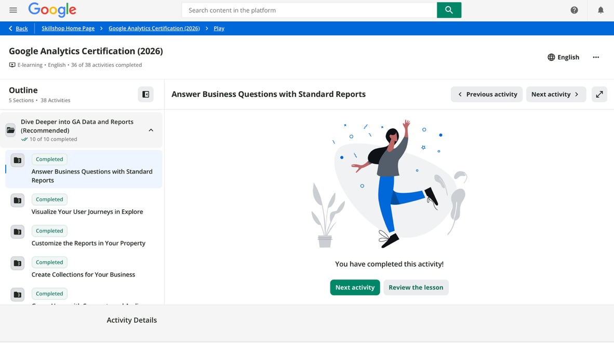
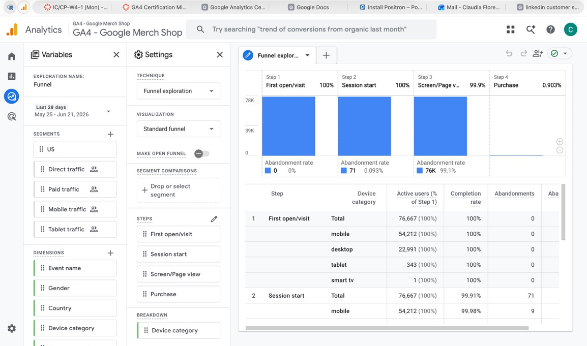
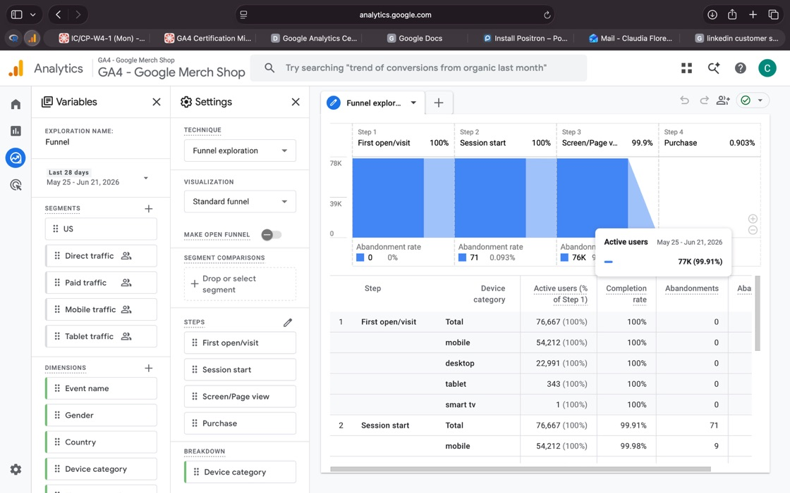

# Track Guidance: Track B (Google Demo)

## Exploration Type: Funnel Exploration

## 1) GA4 Training Submodules

## 2) Evidence Screenshots

Figure 1: Exploration setup

Figure 2: Exploration results

## 3) Short Responses

**1. What question were you trying to answer?**

In Funnel exploration, we get to know how users take steps to complete a goal. The goal can be signing up email, or purchasing. Through funnel exploration, we are able to see if users complete the steps or if the “drop off”, abandon. The question I was trying to answer was where we see the highest increase in “drop offs” happen along the user journey. 

**2. What did you find?**

\* There is a very high abandonment rate of 99.91% (77K users). Which means users are engaging with the page but leaving without making a purchase.

\* Steps 1 to Step 3 are seamless as the first open/visit to the session start to the screen/page are 99.9% or higher.

\* Step 4, the purchase, plummets greatly with not even a 1% rate.

**3. What's your next investigation step based on the results?**

My next investigation step is to create an analysis, perhaps through a funnel system, on why users are viewing the page without buying and what their next steps consist of after viewing and leaving the page.

**4. What's one action you would recommend for your CEP/client?**

\* To create automated emails directed to users who abandoned their carts, offering an incentive to come and complete their purchase.

\* The small incentive can be a discount on their purchase or free shipping (no minimum), in order to have them buy.
