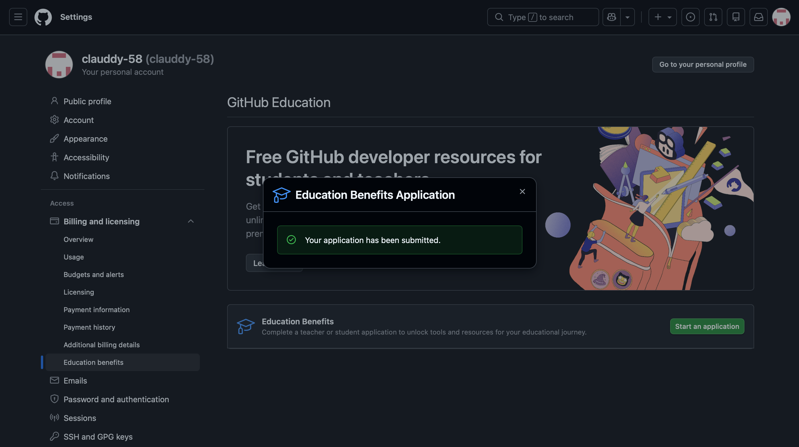
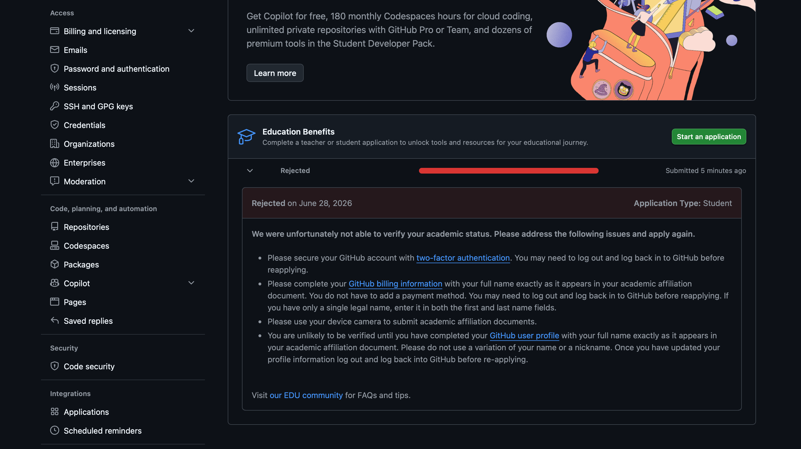

# Executive Summary {#sec-summary}

This Reflection Assignment provides insights on what was learned about Positron and what aspects of it we like in comparison to Rstudio. As we have used Rstudio extensively, we are able to compare with the newly used platform positron.

## I have successfully downloaded positron and become familiar with it.

# What I like about Positron

1.  Positron is a mixture of both rstudio and vs code combined. It's built for data science and has all the great features Rstudio has while containing the same core technology that VS Code has.
2.  Positron is fast, flexible and extensible much like VS code.
3.  It has a good integration with AI code assistance which works very well.
4.  Positron allows to easily switch between languages and has the integrated positron assistance.
5.  The Positron menu is easily established on the left side as a toolbar, with everything you may need.
6.  It is also less clustered, everything is spaced out and is not all closely together.
7.  The AI feature in positron is extremely useful and helpful and can run the code given directly into the console, which is a pretty powerful feature. 

- **Key Advantage 1:** Unified AI Integration tools, like Positron Assistant, for quick and easy help.\[cite: 1\].
- **Key Advantage 2:** Fast and Flexible\[cite: 1\].
  - *Sub-point:* The left-aligned toolbar is incredibly efficient\[cite: 1\].

# AI inside Positron

::: callout-note
## AI within Positron

Positron features a built-in model-agnostic philosophy. This allows for the flawless integration of a wide variety of differentiating AI platforms according to user preferences\[cite: 1\].
:::

::: callout-note

## Two AI Platfroms in Positron

There are two ways in which AI can be used. One is positron assistant, which is an easily accessible tool that can see your scripts and data within positron. The built-in **Positron Assistant** can actively see your scripts and data within the IDE environment. You don't have to copy and paste your code; simply ask it for help directly from your workspace canvas and the positron assistant will immediately get to work in helping. The other is Databot, which is an extension that needs to be installed. It is specific for EDA for new datasets
:::

::: callout-warning
## Subscription Limits

The Positron Assistant is currently free during its initial preview support phase. In order to gain more from positron assistance there is a paid subscription.
:::

## AI tools installed

I have only set up the Positron Assitance as it comes integrated with Positron and there is no further installation needed. As I am only using positron assistance, I can not compare the benefits to both. But, I can say positron assistance proves to be extremely helpful when I am having error codes or problems rendering. It is very easy to use and very manageable with no need to do anything else, simply ask.

## Github Pilot

I applied for an education account but got rejected so I have not been able to gain access into Github education. I will be contacting support for this matter. 

Below you wilI find screenshots of my application to Github education, along with the rejection.

::: panel-tabset
### Positron vs. RStudio

| Feature | RStudio | Positron |
|:--------------------|:------------------------:|:------------------------:|
| Core Engine | Custom Qt/WebEngine | VS Code (Code-OSS) |
| Layout Feel | Clustered, tightly packed | Clean toolbar on left, spacious |
| Multi-language | R-focused (Python secondary) | Equally optimized for R & Python |
| Inline AI Console | Requires external packages | Natively integrated out-of-the-box |
:::