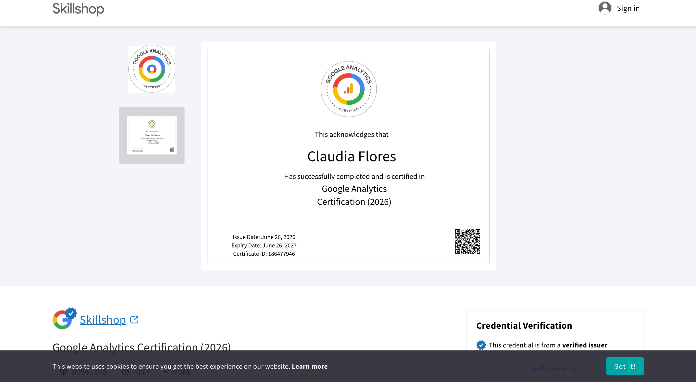
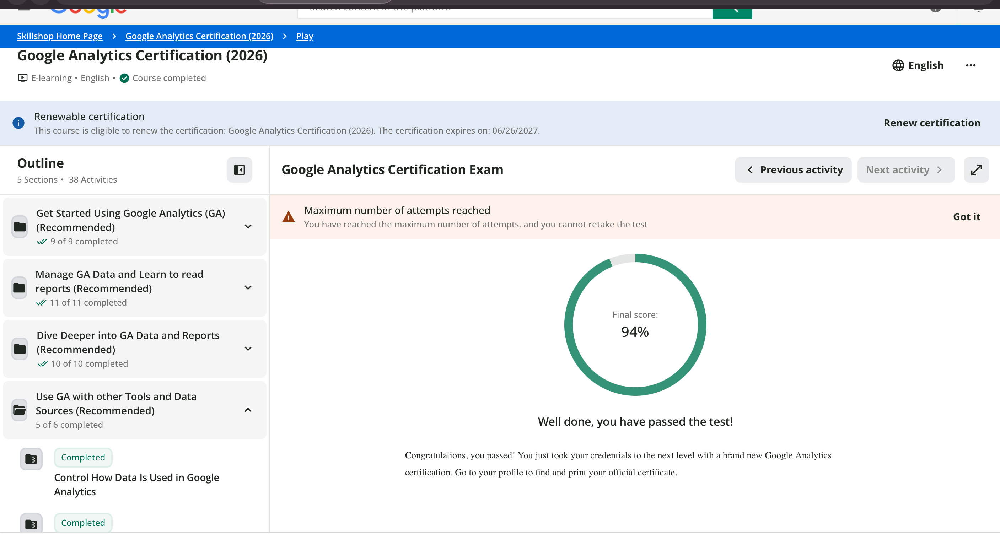
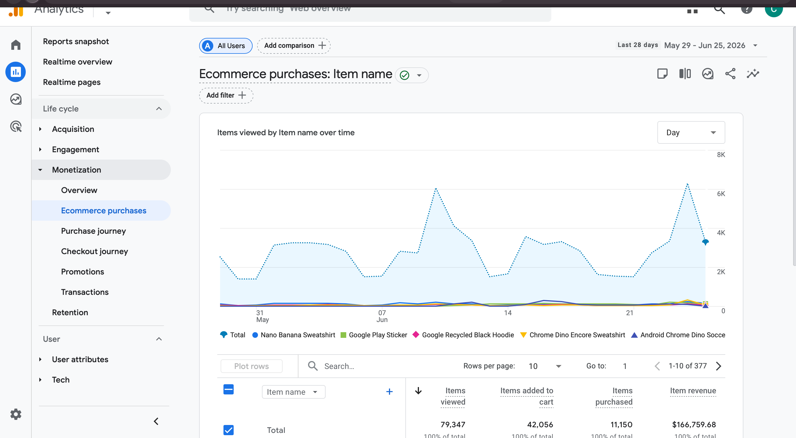
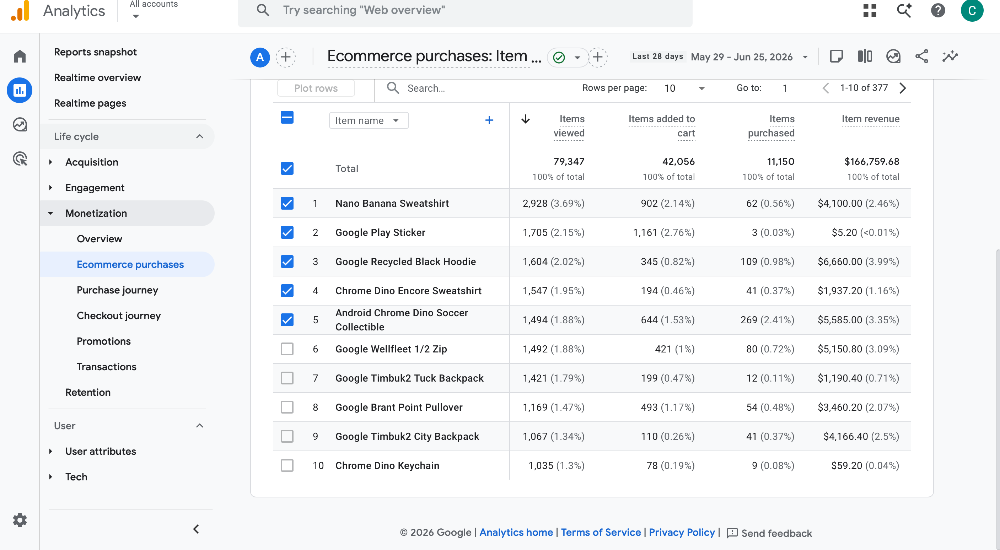

# 1) Proof of Completion

Below is the verification of my Google Analytics 4 Certification completion.

::: callout-note

:::

# 2) Exam Reflection

### Results Summary

I received a passing score of \*\*94%\*\*. Overall, I felt like the questions were straightforward and closely aligned with the material covered in the modules. However, it did feel like some questions could have had multiple answers, or perhaps the specific wording was designed to test your attention to detail. Based on my readings from the modules, it felt like certain parts of the choices could be correct with just slightly different wording. Some questions seemed confusing at first glance, and I had to reread them carefully to fully understand what was being asked. Despite that, it was a good test and felt true to what was taught.

### Top 3 Most Challenging Topics

- Data Streams: Understanding their tracking mechanisms and how analytics are applied across them.

<!-- -->

- Audience Triggers: The wording on these questions was tricky and slightly confusing.

<!-- -->

- BigQuery Integration: Knowing exactly how, when, and why to utilize BigQuery for data exports.

### Two Questions I wish I could redo

- BigQuery Syntax and Concepts: There was a question involving what felt like practical coding or structural logic with BigQuery that challenged me a lot, and which I likely got incorrect. I found it difficult to recall the specific BigQuery technical details during the exam.

<!-- -->

- Audience Trigger Applications: I encountered a question where audience triggers were heavily mentioned, which made things confusing. I felt like the prep modules didn't highlight this specific topic very deeply, leaving me feeling less prepared for how it was tested.

  ### CEP Connection

  One concrete and actionable change I will make to my CEP measurement and analysis plan is shifting how we define, view, and track our main conversions. Instead of relying on a generic conversion framework, we will implement a more tailored framework using a parameters model. This will allow us to customize our data tracking based on the triggering of specific, high-value user events and actions.

  ------------------------------------------------------------------------

# 3) GA4 "Readiness Check" (Option B: Google Demo Account)

### KPI and Report Selection

- Selected KPI: User Engagement

- Supporting Report: Traffic Acquisition Report

### Strategic Alignment

The core KPI I am focusing on is \*\*engagement\*\*, as it measures how deeply users interact with the pages of the website. This KPI directly supports my project goal because user engagement is the primary stepping stone to driving purchases and conversions—higher engagement naturally increases conversion rates.

To analyze this, I am using the \*\*Traffic Acquisition Report\*\* as my supporting report. This report allows us to break down exactly which marketing channels are successfully engaging users the most. By identifying these top-performing channels, I can make data-driven decisions on where to focus our marketing efforts to scale traffic and maximize conversions.

::: {.callout-note}}  :::

